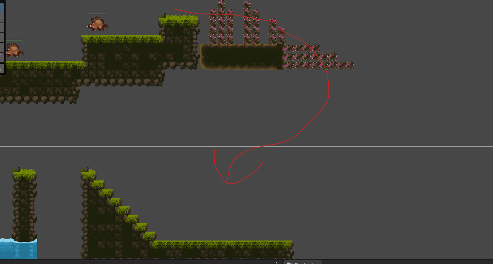
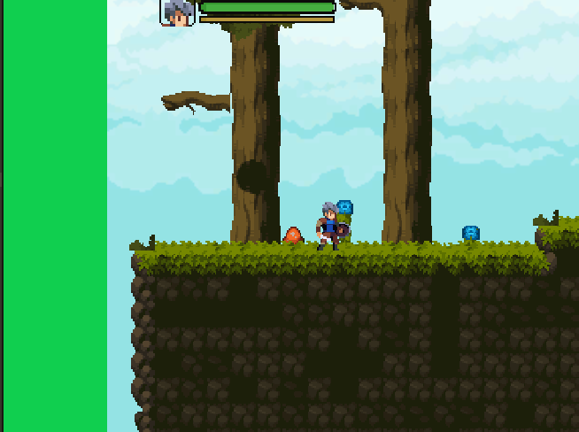

# 
10.14提交说明

 张佳和

 2023/10/14 

 ___ ____   
 

## 一、实现内容
1. 增加TemporalExit,玩家接触后返回主菜单,象征通关
## 二、脚本修改
1. 修改UIManager,修复从Restart界面返回主菜单后开始游戏时间暂停bug
2. 增加ExitLevel脚本，挂载的物体触碰到后返回主菜单
## 三、可能出现的bug及解决方案
## 四、其他修改
1. 切割sprite获得TemporaryExit的贴图
## 五、值得考虑的需求
1. 关卡一最好把荆棘做成无法穿过的，不然可以如图快速通关
2. 获取二段跳后跳出提示信息
3. 如图，长宽比与background不一致时会有突兀感，建议增大background大小，或者选择与background过渡较好的底色 
4. 一开始的野猪建议把血条加上去

