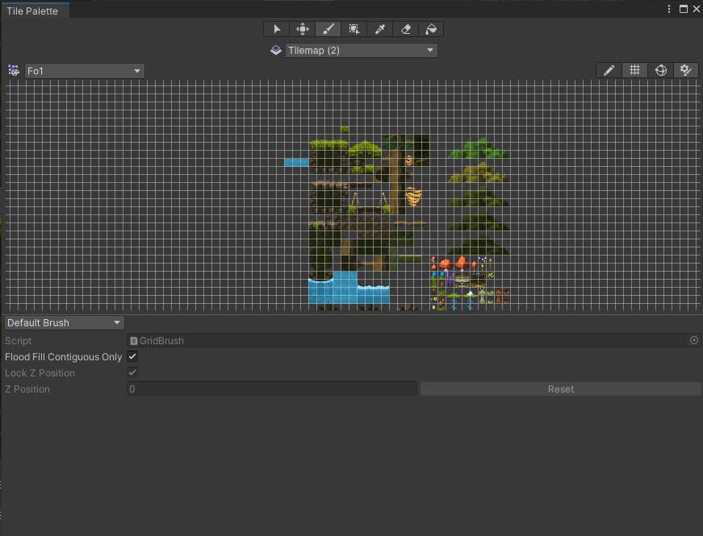
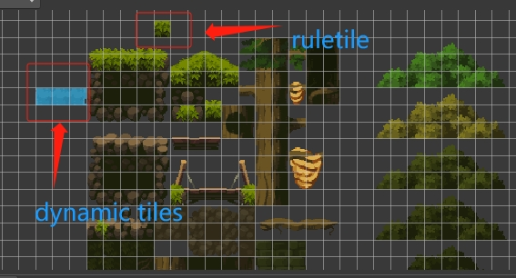

# <center>已有API与实现说明
<p align='right' style="font-size:19px;font-family:华文行楷"> 张佳和</p>
<p align='right'style='font-family:chiller'> 2023/9/29 </p>

 ___ ____   
 <p>
<span style="letter-spacing:1px">

##  一、简要介绍与教程内容的差异
1. 人物、敌人的图片翻转都是用Sprite Renderer的FlipX属性实现的，而不是视频教程中的Transformer.ScaleX，所以物体坐标轴始终没有改变（而Scale的正负会改变它），因此判断运动方向、受力朝向的代码实现起来不一样。
2. 野猪的死亡没有使用教程中的IEnumerator，因为记不住用法，用的是`UnityEvent  OnDie`+绑定`Die()`函数触发死亡动画，然后使用Animator中退出死亡动画状态的`OnStateExit()`函数实现Boar的销毁
3. InputSystem中在UI中增加了Restart模块，R键触发，用来复活玩家方便测试。为了实现复活的效果，增加了Restart脚本，且将Playercontroller中人物死亡时本该让inputsystem `Disable()`改成了仅仅是Gameplay模块 `Disable()`,从而能够复活
_____
## 二、素材实现
1. 人物、怪物图片(实现与教程一致，可能有的漏改了无伤大雅):
   >Path:点击对应GameObject的Sprite Renderer的Sprite可自行定位
   >Texture Type:Sprite(2D and UI)
   >Sprite Mode:Multiple
   >Pixels Per Unit:16
   >Fliter Mode:Point(no filter)
   >Compression:None
   >Sprite Editor:各不相同
2. 背景(Grid):
   >图片Path:Assets/Legacy-Fantasy - High Forest 2.0/Legacy-Fantasy - High Forest 2.3/Assets/Forest!!!.png
   >Tile Palette:有三个Palette,其中只有Fo1有ruletiles和Dynamictile
   >
   >**Fo1中特殊tile如下**
   >
   >Tile Path:Assets/Legacy-Fantasy - High Forest 2.0/Legacy-Fantasy - High Forest 2.3/Assets/Palettes<br>
   >在Grid下有很多Tilemap,其中2是用rule tiles画的大部分地图，water是用Dynamic tile画的瀑布和普通的草，main是靠近player的地形，应该是ruletiles，可以考虑和2合并，2就是当时玩ruletile搞的
   >sorting layer和order in layer有合理的顺序，需要时请自行查看修改
   >tile的命名、ruletile/dynamic的实现细节如有需要请自行查看
3. player和boar的组件
   >Rigidbody 2D:
   >>gravity scale:4,
   >>mass:1.
   >>Freeze Rotation:Z

   > Capsule Collider:
   >>用途：boar为触发器判定碰撞伤害,Player为碰撞器
   >isTrigger:Boar:true,player:false
   
   >Box Collider:
   >>boar的组件：boar的碰撞器

   >Animator:
   >>动画控制器
   
   >Transform、Sprite Renderer:
   >>略

    <hr>
    以下为脚本组件

   >Physics Check:判定是否撞墙、是否着地
   Character:血量、无敌时间、受伤和死亡事件挂载
   Attack:碰撞伤害等
   Restart:R键人物满血复活至复活点
   Boar:boar的巡逻、攻击、追逐等逻辑，继承于Enemy
   Playercontroller:人物控制器，包含人物的移动、攻击、受伤、死亡逻辑和参数设置。命名不规范，需要改进
   Playeranimation:人物的animator参数控制器。命名不规范，需要改进


4. PhysicsMaterial
   >Normal:
   >>Friction:0.4
   >>Bounciness:0

   >Wall:
   >>Friction:0
   >>Bounciness:0

   
5. Camera*2：
   >Main Camera在display1
   >Camera在display2
6. EventSystem
   >根据教程（状态栏部分）加的，目前还没有用到
7. Canvas：
   >描述：状态栏，UI
   位于Display2中
   
   >HealthBar、PowerBar、Head：顾名思义
   >R:red G:green F:frame Y:yellow cut:一层mask H:head
8. Input System
   >用的是Player作为名字，与教程不一样，不太合适，建议修改
   >自动产生Playerc#脚本
   path:Assets/Settings/Input System
9. Animator
    >都是根据教程写的，一些细微差别很容易辨别，写不动了，有问题问我
_____
## 三、API / 已有代码简介[^sd]

1. <span style='color:#3399FF'>PlayerStateBar</span>
   + <span style="color:red">根据教程内容创建</span>
   + 还没开始写，挂在PlayerStateBar上，用来控制状态栏随人物状态变化
2. <span style='color:#3399FF'>Attack</span>
   + <span style="color:red">根据教程内容创建</span>
   + damage:伤害量
   + attackRange, attackRate：未用到
   + OnTriggerStay2D:所属触发器被持续接触时调用的函数，这里`collision.GetComponent<Character>()?.TakeDamage(this);`实现让触发者受伤的功能
3. <span style='color:#3399FF'>BaseState</span>
   + <span style="color:red">根据教程内容创建</span>
   + 抽象类，要求子类实现状态的进入、退出、更新函数，以及获取当前敌人
   ```cs
    protected Enemy currentEnemy;
    public abstract void OnEnter(Enemy enemy);
    public abstract void LogicUpdate();
    public abstract void PhysicsUpdate();
    public abstract void OnExit();
    ```
4. <span style='color:#3399FF'>Boar</span>
      + <span style="color:red">根据教程内容创建</span>
      + 继承Enemy
      + Awake函数实现父类中patrolState绑定为BoarPatrolState()、chaseState绑定为ChaseState()以及调整BoxCollider 2D的偏移量（这点没什么用，之前debug加的）
5. <span style='color:#3399FF'>BoarPatrolState</span>
      + <span style="color:red">根据教程内容创建</span>
      + OnEnter函数实现敌人绑定和正常速度的变换
      + LogicUpdate函数：如果发现敌人切换为ChaseState,未发现敌人时到悬崖边或撞墙实行等待，其他情况下走路
      + OnExit函数实现将animator参数walk置false以便状态切换
6. <span style='color:#3399FF'>Character</span>
      + <span style="color:red">根据教程内容创建</span>
      + 变量设置
         ```cs
         [Header("基本属性")]
         public float maxHealth;//最大生命值
         public float currentHealth;//当前生命值
         // Start is called before the first frame update//vs自带注释
         [Header("受伤无敌")]
         public float invulnerableDuration;//无敌时间
         private float invulnerableCounter;//无敌倒计时
         public bool invulnerable;//是否无敌
         public UnityEvent<Transform> OnTakeDamage;//受伤的事件
         public UnityEvent OnDie; //死亡的事件
         ```
      + Start函数 使初始血量等于最大血量
      + TakeDamage函数：如果无敌则返回，否则如果伤害量小于当前生命值时更新生命值并触发无敌、OnTakeDamage事件,反之生命值置0触发OnDie事件
      + Update函数：实现无敌时间的倒计时，倒计时结束后无敌状态置false
      + TriggerInvulnerable函数实现触发无敌的逻辑，即无敌状态置true，无敌时间计时器复位。此外，已处于无敌状态时该函数不会重置无敌时间。
7. <span style='color:#3399FF'>ChaseState</span>
      + <span style="color:red">根据教程内容创建</span>
      + OnEnter函数实现锁敌、状态计时器复位、速度为追逐速度、将animator参数run置true以便状态切换的效果
      + LogicUpdate函数实现状态计时器的更新、以及撞墙、悬崖边立即反向的效果
      + OnExit函数实现将animator参数run置false以便状态切换
8. <span style='color:#3399FF'>Enemy</span>
   + <span style="color:red">根据教程内容创建</span>
   + 参数变量
      ```cs
      Rigidbody2D rb;
      [HideInInspector] public Animator anim;
      [HideInInspector]public PhysicsCheck pc;
      [HideInInspector]public SpriteRenderer sr;
      //以上为其他组件的相关引用
      [Header("基本参数")]
      public float normalSpeed;//走路速度
      public float chaseSpeed;//追逐速度
      public float currentSpeed;//当前速度
      public Vector3 faceDir;//面朝方向
      public float hurtForce;//受伤时受力大小
      public Transform attacker;//受伤时的攻击者
      [Header("检测")]
      public Vector2 centerOffset;//Physics Check中心据物体坐标的偏移量
      public Vector2 checkSize;//pc检测范围
      public LayerMask attackLayer;//攻击者所属层次
      public float checkDistance;//巡视前方可发现玩家的最大距离

      [Header("计时器")]
      public bool wait;//是否等待，idle
      public float waitTime;//等待时间
      public float waitCounter;//等待状态计时器
      public float lostTime;//锁敌时长
      public float lostCounter;//锁敌计时器
      [Header("状态")]
      public bool isHurt;//是否受伤
      protected BaseState currentState;//当前状态
      protected BaseState patrolState;//巡逻状态
      protected BaseState chaseState;//追逐状态
      ```
   + Awake函数实现初始化组件变量、速度、等待时间
   + OnEnable函数实现初始状态为巡逻状态
   + Update函数更新FaceDir即面朝方向，调用当前状态的逻辑更新函数、并实现计时器的更新
   + FixedUpdate实现是否移动(调用Move函数)的判断，并调用当前状态的物理更新函数
   + OnDisable函数实现当前状态的退出
   + Move函数实现速度的更新
   + TimeCounter函数实现等待计时器、锁敌计时器的更新，其中等待计时器及时完成后调整flipX，间接调整FaceDir、velocity的方向
   + FoundPlayer函数实现巡逻是否在前方发现敌人的判断
   + SwitchState函数实现currentState的状态切换
   + TakeDamage函数：暂停敌人的移动，并面朝玩家(修改flipX)，触发受伤动画、受到击退的力
   + Die函数修改当前死亡敌人的层次为ignore防止继续伤害玩家，并触发死亡动画
   + OnDrawGizmosSelected函数在Gizmos显示的情况下显示地面检测的范围(这里当时debug没用checkSize，因此显示大小不完全一致，可修改)
9.  <span style='color:#3399FF'>Enums</span>
      + <span style="color:red">根据教程内容创建</span>
      + 三个枚举状态：Patrol,Chase,Skill
10.  <span style='color:#3399FF'>ExitDie</span>
       + 自行创建
       + 绑定在Boar的Animator的Die状态的退出上，OnStateExit函数实现死亡动画播放完后Boar对象的销毁
11.  <span style='color:#3399FF'>ExitHurt</span>
       + <span style="color:red">根据教程内容创建</span>
       + 绑定在boar上
       + OnStateExit和OnStateEnter控制 animator.GetComponent<Enemy>().isHurt的赋值，从而保证播放受伤动画时Boar仍然处于受伤状态，切换后回归正常（OnStateEnter可能多余）
12.  <span style='color:#3399FF'>GetHurt</span>
       + <span style="color:red">根据教程内容创建</span>
       + 绑定在player上
       + OnStateExit控制人物受伤动画播放完后isHurt复位为false
13. <span style='color:#3399FF'>LeaveAttack</span>
      + <span style="color:red">根据教程内容创建</span>
      + 绑定在player上
      + OnStateEnter和OnStateExit控制人物攻击动画时isAttack为true退出后为false
14. <span style='color:#3399FF'>PhysicsCheck</span>
    + <span style="color:red">根据教程内容创建</span>
    + 参数变量
      ```cs
      private CapsuleCollider2D coll;
      SpriteRenderer sr;//组件变量引用
      [Header("检测参数")]
      public bool manual;//是否手动设定leftOffset、rightOffset
      public bool isGround;//是否捉地
      //public bool isNearCliff;//debug废弃代码
      public bool touchLeftWall;//是否撞左边墙
      public bool touchRightWall;//是否撞右边墙
      public LayerMask GroundLayer;//地面的层级
      public float checkRadius;//检测范围
      public Vector2 bottomOffset,leftOffset,rightOffset;//检测地面、左边墙、右边墙的检测中心点偏移
      ```
    + Awake绑定组件变量，根据manual值初始化各检测中心点偏移
    + Check被Update调用，判断并给isGround、touchLeftWall、touchRightWall变量赋值
    + OnDrawGizmosSelected用Gizmos辅助显示左右墙检测范围
15. <span style='color:#3399FF'>Playeranimation</span>
    + <span style="color:red">根据教程内容创建</span>
    + 变量均为组件引用
    + Awake给组件引用初始化
    + SetAnimation根据人物当前状态给animator中各个参数赋值，以达到状态转变的功能
    + Update调用SetAnimation,时刻保持animator参数与人物状态的同步
    + PlayHurt使Animator的hurt触发器触发，以此调用受伤动画
    + PlayAttack使Animator的attack触发器触发，以此调用攻击动画
16. <span style='color:#3399FF'>PlayerController</span>
    + <span style="color:red">根据教程内容创建</span>
    + 参数变量
      ```cs
      public Player inputControl;//InputSystem
      public Vector2 inputDirection;//InputSystem的WASD方向
      //public Transform AttackArea;
      private Rigidbody2D rb;
      private PhysicsCheck PCheck;// = GetComponent<PhysicsCheck>();
      private Playeranimation pa;//以上为组件引用
      [Header("基本参数")]
      public float speed;//速度
      public float hurtForce;//受伤时受到的力
      public float jumpForce;//跳跃力
      [Header("基本状态")]
      public bool isHurt,isDead;
      public bool isAttack;//顾名思义
      [Header("物理材质")]
      public PhysicsMaterial2D normal;
      public PhysicsMaterial2D wall;//绑定两种物理材质
      ```
    + Awake绑定各组件变量，并绑定攻击键和跳跃键按下时触发的事件
    + OnEnable激活InputSystem
    + OnDisable使InputSystem失效
    + Update更新当前从InputSystem中获得的移动方向，并设置如果玩家坠入虚空时返回复活点的逻辑(方便debug用，可删)
    + FixedUpdate实现移动逻辑，并根据是否在空中修改人物材质，防止恶意贴墙
    + Move实现速度随输入的更新、人物图像的翻转、人物攻击区域的翻转（人物翻转由flipX实现时才需要这么翻转）
    + Jump实现如果着地给予player向上的跳跃力
    + GetHurt实现人物速度归0，并受到伤害来源方向的力
    + Dead函数实现人物速度归零，并禁用人物操作，触发死亡
    + DoAttack将人物水平速度置零，触发攻击动画
    + CheckState实现人物空中不卡墙的材质切换
    + 类Playercontroller类名不符合命名规范，应当修改
17. <span style='color:#3399FF'>Restart</span>
    + 自行创建
    + Awake获取组件变量，并让InputSystem的Restart事件绑定上RRstart函数
    + RRstart函数实现人物在复活点重生的效果
    + 该脚本其实可以重构到PlayerController中，也可以删除
18. <span style='color:#3399FF'>Player</span>
    + <span style="color:red">根据教程内容创建</span>
    + 由Player 该InputSystem自动生成

[^sd]: 所有除Player.cs外脚本的位置:Assets/Scripts.
</span>
</p>